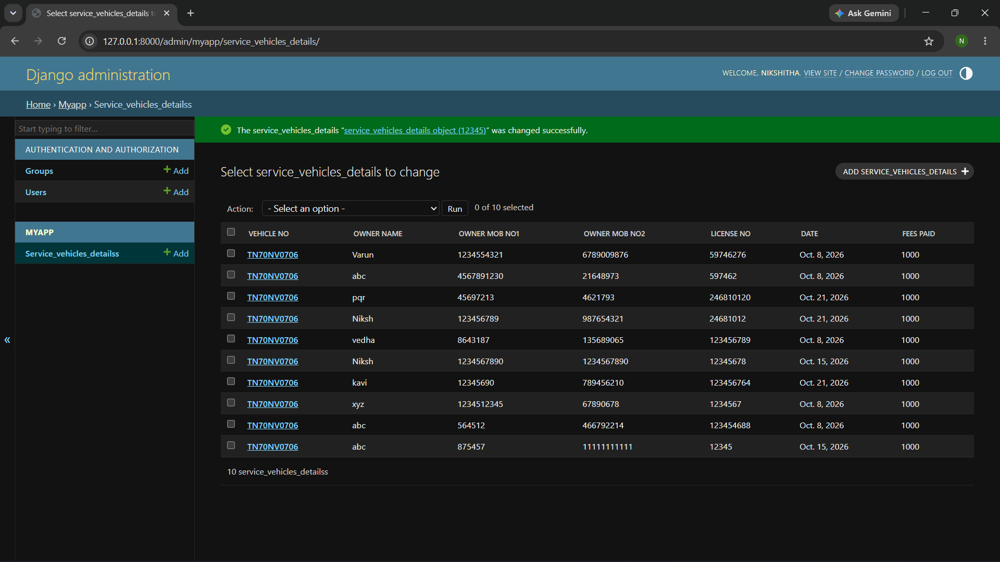

# Ex02 Django ORM Web Application
## Date: 06-10-2026

## AIM
To develop a Django Application to store and retrieve data from a Vehicle Service Database platform using Object Relational Mapping(ORM).


## DESIGN STEPS

### STEP 1:
Clone the problem from GitHub

### STEP 2:
Create a new app in Django project

### STEP 3:
Enter the code for admin.py and models.py

### STEP 4:
Detect changes and create migration files that describe how to modify the database schema

### STEP 5:
Execute the migration files and update the database schema to match your Django models

### STEP 6:
Create a superuser with full access rights to all models and data through the admin interface.

### STEP 7:
Apply the migration files of the created app to the database

### STEP 8:
Execute Django admin using localhost and create details for 10 entries

## PROGRAM
```
models.py
from django.db import models
from django.contrib import admin
class service_vehicles_details(models.Model):
    vehicle_no=models.CharField(max_length=10)
    owner_name=models.CharField(max_length=5)
    owner_mob_no1=models.IntegerField()
    owner_mob_no2=models.IntegerField()
    license_no=models.CharField(max_length=10,primary_key=True)
    date=models.DateField()
    fees_paid=models.CharField(max_length=10)
class service_vehicles_detailsAdmin(admin.ModelAdmin):
  list_display=["vehicle_no","owner_name","owner_mob_no1","owner_mob_no2","license_no","date","fees_paid"]

admin.py
from django.contrib import admin
from .models import service_vehicles_details,service_vehicles_detailsAdmin
admin.site.register(service_vehicles_details,service_vehicles_detailsAdmin)

```


## OUTPUT



## RESULT
Thus the program for creating Online Food Delivery Database using ORM hass been executed successfully
